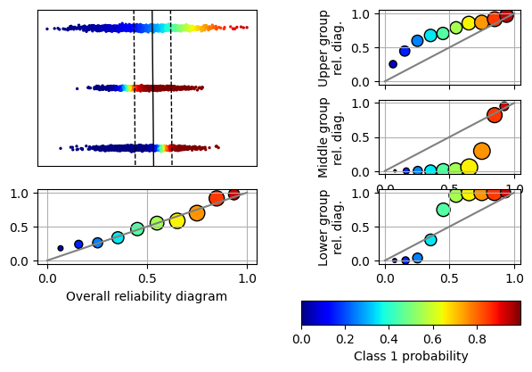
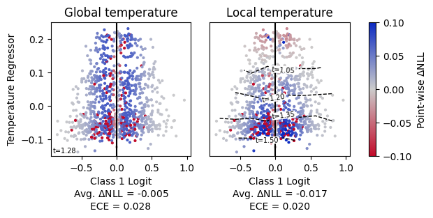

# FM-calibration

Local calibration and Foundation Models (FMs).

## Setup

Package requires python 3.12, as well as libraries listed in `requirements.txt`. Moreover, `https://github.com/ThyrixYang/group_calibration` package is required.

Experiment data can be downloaded using notebooks contained in `./data`

## Usage

Various (local) calibration methods are applied on classification task in notebook `local_calibration.ipynb`.

### Synthetic classification problems

`src/fm_calibration/synthetic_data.py` provides a way to generate synthetic classification tasks where linear classifier exhibits natural locally-dependent calibration. See below such example of generated data.

### Local recalibration

We propose a local recalibration method based on clustering of embedding space of FMs. We also compare with <https://arxiv.org/abs/2102.10809>, <https://arxiv.org/abs/2306.04985>.

See below example of local temperature scaling.

